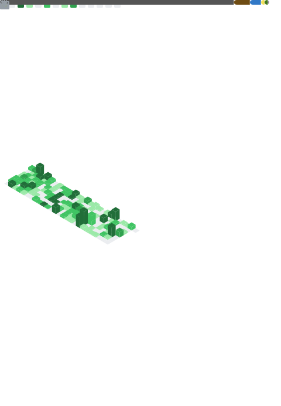

# ☀️ chaxus

👋 Hi, I'm chaxus  
📚 Learning & Exploring

## 🚀 Projects

### TypeScript
- **[ranui](https://ran.chaxus.com/src/ranui/)** - A simple UI component library using Web Components
- **[ranuts](https://ran.chaxus.com/src/ranuts/)** - Some TypeScript utilities and code snippets I've collected
- **[ranlexer](https://github.com/chaxus/ranlexer)** - A basic JavaScript AST parser and generator

### C/C++
- **[ramedia](https://github.com/chaxus/ramedia)** - Trying to bring ffmpeg to the browser with WebAssembly

---

## 🛠️ Contribution

- **[vite](https://github.com/vitejs/vite)** - Next Generation Frontend Tooling
- **[prettier](https://github.com/prettier/prettier)** - Opinionated Code Formatter
- **[ai-elements](https://github.com/vercel/ai-elements)** - AI Elements is a component library built on top of [shadcn/ui](https://github.com/shadcn-ui/ui) to help you build AI-native applications faster
- **[streamdown](https://github.com/vercel/streamdown)** - A drop-in replacement for react-markdown, designed for AI-powered streaming

---

## 🌐 Website

- **[ran](https://ran.chaxus.com/)** - My personal site with some basic features like dark mode, PWA, and documentation
- **[document](https://edit.chaxus.com/)** - A web-based Office viewer and editor built with OnlyOffice WASM. Pure web client with no server required

---

## 📊 Stats

---

  

