<!--
<h2>☀️ hello world</h2>
- 👋 Hi, I’m chaxus
- 👀 I am an developer.
- 🌱 I’m currently learning FE.
✉️ Mail: 81380@163.com

- Before (2020 - 2024): Work for neworiental.
- Now: work for Longbridge.
-->

☀️ Rust/C/C++/TypeScript
- Mail: 81380@163.com
- WeChat: `ranuts`
- Juejin: [然燃](https://juejin.cn/user/2981531263964718/posts)
- Twitter / X: [chaxus1](https://x.com/chaxus1)
- Facebook: [Ferguson Ethan](https://www.facebook.com/profile.php?id=61563949343290)
- Reddit: [sometime_9](https://www.reddit.com/user/sometime_9/)

<!--
- Linkedin: [Ferguson Ethan](https://www.linkedin.com/in/ferguson-ethan-3423752b9/)
-->
<h2>Featured</h2>

<h3>TypeScript</h3>

- [ranui](https://github.com/chaxus/ran) - The ultimate solution for the `UI component` library lies in leveraging `Web components`, which are framework-agnostic and adaptable to any framework, ensuring seamless integration and flexibility.
- [ranuts](https://github.com/chaxus/ran) - My extensive code library comprises a comprehensive collection of common `TypeScript` functions, handy code snippets, various tools, and much more.
- [ranlexer](https://github.com/chaxus/ranlexer) - A compact `JavaScrip` `AST` parser and generator, designed for efficiency and simplicity.

<h3>C/C++</h3>

- [ramedia](https://github.com/chaxus/ramedia) - Utilize `Emscripten` to compile `ffmpeg` into `wasm`, enabling browser-based execution for diverse video processing and manipulation tasks. However, the currently generated `wasm` file is quite bulky and lacks satisfactory performance, necessitating file splitting and performance optimization efforts.

<h2>Contributed</h2>

- [vite](https://github.com/vitejs/vite) - Next Generation Frontend Tooling.
- [prettier](https://github.com/prettier/prettier) - `Prettier` is an opinionated code formatter.

<h2>Website</h2>

- [chaxus](https://chaxus.github.io/ran/) - The site offers `dark mode`, `Service Worker`, `i18n` internationalization enhancements, seamless experience as a `PWA`, and efficient content delivery through `SSG`. It tracks user behavior with `google` and `baidu` analytics. The site includes essays, tool function documents, and my own web `UI component` documents. Updates are automatically deployed to my`GitHub Page` via `GitHub Actions`.

<h2>Coding</h2>

    

<!--
chaxus/chaxus is a ✨ special ✨ repository because its `README.md` (this file) appears on your GitHub profile.
You can click the Preview link to take a look at your changes.

  
  

 -->
<!--
 -->
<!--  -->

  <!-- 
   -->
    

<!-- - ✨   ✨ -->
